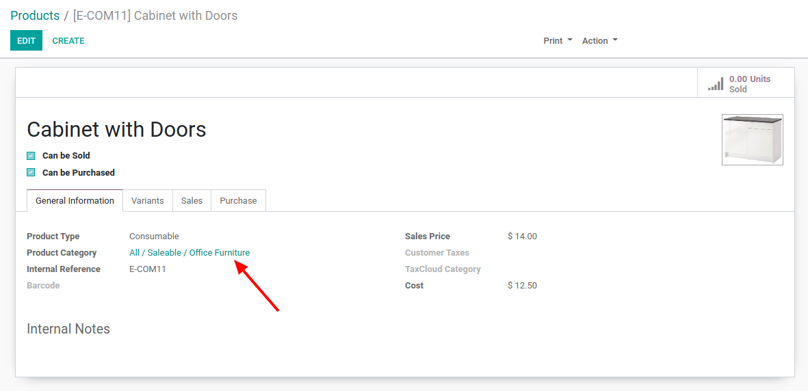

# What
This module contains informations about `name_get(self)` method and `_rec_name` field.

`_rec_name` and `name_get(self)` are used to change the display name of the model.

If you want to use another name everytimes you use this model, set `_rec_name` to an existing field and the value of this field will be used instead of the `name` field.

If you want to use another name at specific times, use `name_get(self)` instead.

# Examples
I have made an example with `_rec_name` field. See [custom_model.py](models/custom_model.py) and the views [here](views/custom_model.xml) and [here](views/res_partner.xml)

Here are other examples taken from the odoo source code (v13):

## _rec_name
- [Here](https://github.com/odoo/odoo/blob/127410f9dcf9f07eba2ca9999e9427889e25f6df/addons/product/models/product.py#L23) is an example of this field. The result is 
  - In that case, everytimes you have a link with `product.category`, this is what will be displayed.

## name_get(self):
- [Here]()

# More
- [_rec_name](https://www.odoo.com/documentation/13.0/reference/orm.html#models)
- [name_get](https://www.odoo.com/documentation/13.0/reference/orm.html#odoo.models.Model.name_get)
